# Medistar backend guide

This document explains how the **`Backend/`** service works: startup sequence, how HTTP requests flow through Express routers, how MongoDB models relate to each other, and what each API area does. It also calls out important quirks and security issues visible in the current code.

---

## 1. What stack this backend uses

| Piece | Role |
| --- | --- |
| **Node.js + Express** | HTTP API (`index.js` mounts routers). |
| **MongoDB + Mongoose** | Persistence (`config/db.js`, `models/*.model.js`). |
| **bcrypt** | Password hashing on user signup. |
| **jsonwebtoken** | JWT issued on user login (see caveat below). |
| **nodemailer** | Sends OTP email (signup) and appointment confirmation email. |
| **cors** | Allows browser clients from other origins. |

**Declared but not wired in code paths:** `sequelize`, `mysql2`, and active **Redis** usage appear only in commented blocks (`package.json` still lists them). **`PatientModel`** exists but is not used by any router (only imported and unused in `adminDash.router.js`).

---

## 2. Startup: step-by-step

1. **`index.js` loads `dotenv`** so `process.env.*` (e.g. `port`, `mongoURL`) is available.
2. **Express app is created** and middleware applied:
   - `express.json()` — parses JSON bodies into `req.body`.
   - `cors()` — enables cross-origin requests (no restricted origins in code).
3. **Routers are mounted** under fixed URL prefixes:

   | Prefix | Router file | Purpose |
   | --- | --- | --- |
   | `/user` | `routers/user.router.js` | Patients/users: OTP email, signup, login. |
   | `/department` | `routers/department.router.js` | Departments CRUD. |
   | `/doctor` | `routers/doctor.router.js` | Doctors CRUD, search, approvals. |
   | `/appointment` | `routers/appointment.router.js` | Slots, booking, patient/admin appointment ops. |
   | `/admin` | `routers/adminDash.router.js` | Admin login/signup (basic) + dashboard aggregate data. |

4. **`app.listen(process.env.port, …)`** runs the server **after** awaiting **`mongoose.connect`** from `config/db.js`:
   - On success: logs DB connected and listening port.
   - On failure: logs DB error.

The **`authenticate`** middleware (`middlewares/authenticator.mw.js`) exists and is used on several appointment routes, but it is **commented out** in `index.js` (only noted there as a comment — global auth is not applied at app level).

---

## 3. Database connection

**File:** `config/db.js`

- Sets Mongoose `strictQuery` to `true`.
- Connects with **`mongoose.connect(process.env.mongoURL)`** and exports the resulting promise as `connection`.
- **`index.js`** awaits this promise when the server starts, so the API process assumes MongoDB is reachable before accepting traffic.

---

## 4. Authentication middleware (JWT)

**File:** `middlewares/authenticator.mw.js`

**Flow:**

1. Read **`Authorization`** header as the raw token string (not `Bearer <token>` parsing — the client must send the token exactly as stored).
2. If missing → respond with `{ msg: "Enter Token First" }`.
3. Otherwise **`jwt.verify(token, process.env.key)`**.
4. On success, decode **`userID`** and **`email`** and attach them to **`req.body.userID`** and **`req.body.email`**, then `next()`.
5. On failure → e.g. `{ msg: "Token Expired" }`.

**Important inconsistency:** In `routers/user.router.js`, tokens are **signed with the hard-coded secret `"masai"`**, not `process.env.key`. Unless your `.env` **`key`** is exactly **`masai`**, **`authenticate` will reject valid login tokens**. For production you should use **one** secret from environment for both `sign` and `verify`.

Redis-based token blacklist logic is **commented out** in this file.

---

## 5. Data models (MongoDB collections)

### 5.1 User (`models/user.model.js`)

Represents a registered patient/user.

| Field | Notes |
| --- | --- |
| `first_name`, `last_name` | Required strings. |
| `email` | Required, **unique**. |
| `mobile` | Required, **unique**. |
| `password` | Stored **hashed** (bcrypt) after signup. |

Collection name defaults to Mongoose pluralization of `"user"`.

### 5.2 Doctor (`models/doctor.model.js`)

| Field | Notes |
| --- | --- |
| `doctorName`, `qualifications`, `experience`, `city` | Required strings. |
| `email`, `phoneNo` | Required, **unique**. |
| `departmentId` | **Number** (matches frontend department IDs 1–10). |
| `status` | Boolean; **`false` = pending approval**, **`true` = approved** (admin workflow). |
| `image` | Optional URL/string. |
| `isAvailable` | Boolean default **`true`**; used when checking booking eligibility. |
| `APRIL_11`, `APRIL_12`, `APRIL_13` | Arrays of slot strings (legacy naming). |

**Note:** `routers/doctor.router.js` **`POST /addDoctor`** initializes **`APRIL_11`–`APRIL_13`**, while **`appointment.router.js` slot logic** references **`APRIL_04`, `APRIL_05`, `APRIL_06`** on the doctor document. That mismatch means slot checks may not align with how doctors are created unless documents are fixed manually or code is unified.

### 5.3 Appointment (`models/appointment.model.js`)

| Field | Notes |
| --- | --- |
| `patientId`, `doctorId` | Stored as **strings** (IDs from Mongo). |
| `patientFirstName`, `docFirstName` | Denormalized names for quick display. |
| `ageOfPatient`, `gender`, `address`, `problemDescription`, `appointmentDate` | Booking details. |
| `createdAt` | Default `Date.now`. |
| `status` | Boolean default **`false`** — used as **admin “approval / payment” style flag** in the UI (e.g. “Paid” after approve). |
| `paymentStatus` | Separate boolean default `false` (not heavily used in the routers shown). |

### 5.4 Department (`models/department.model.js`)

| Field | Notes |
| --- | --- |
| `departmentId` | **Number**, unique business key (not necessarily Mongo `_id`). |
| `deptName`, `about`, `image` | Required. |

### 5.5 Admin (`models/admin.model.js`)

| Field | Notes |
| --- | --- |
| `name`, `email`, `password` | **`password` is plain text** in DB — no bcrypt in admin login/signup paths shown. |

### 5.6 Patient (`models/patient.model.js`)

Defined schema (**`userId` as Number**, etc.) but **no router persists or reads this model** in the current codebase. Booking ties appointments to **`UserModel`** via `patientId`.

---

## 6. Request flows (end-to-end)

### 6.1 User registration with OTP

```mermaid
sequenceDiagram
  participant Client
  participant API as Express /user
  participant Mail as Gmail SMTP
  participant DB as MongoDB

  Client->>API: POST /user/emailVerify { email, ... }
  API->>API: otpGenerator 4-digit OTP (module-level var `otp`)
  API->>Mail: sendMail(to: email)
  Mail-->>API: ok / error
  API-->>Client: { msg, otp, email } (OTP also returned in JSON)

  Client->>API: POST /user/signup { first_name, last_name, email, mobile, password }
  API->>DB: UserModel.findOne({ email })
  alt email exists
    API-->>Client: 500 User already registered
  else new user
    API->>API: bcrypt.hash(password)
    API->>DB: new UserModel(...).save()
    API-->>Client: 201 Signup Successfull
  end
```



**Notes:**

- OTP is emailed via **hard-coded Gmail credentials** in `user.router.js` (security risk — should be env vars + app passwords).
- The HTTP response from **`/emailVerify` includes the OTP in the JSON body**; the frontend historically also stored it from the response. Returning OTP to the client defeats the purpose of email verification from a security standpoint.

### 6.2 User login

**Endpoint:** `POST /user/signin` with `{ payload, password }`.

1. Treat **`payload`** as either **email** or **mobile**:
   - Try `UserModel.findOne({ email: payload })`.
   - If missing, try `findOne({ mobile: payload })`.
2. If still missing → **`500` `{ msg: "User not Found" }`** (frontend checks this string).
3. **`bcrypt.compare`** against stored hash.
4. On match → issue JWT:

   ```js
   jwt.sign({ userID: userMobile._id, email: userMobile.email }, "masai")
   ```

5. Response includes **`token`**, **`name`** (first name), plus email/mobile fields. Typo field **`mag`** used for wrong password on one branch.

### 6.3 Listing and filtering doctors

**Examples:**

- `GET /doctor/allDoctor` — all doctors; response `{ total, doctor }`.
- `GET /doctor/search?q=...` — case-insensitive regex on `doctorName`.
- `GET /doctor/allDoctor/:id` — by **`departmentId`** (string param compared as equality to numeric field in schema).

Add/remove/approve:

- `POST /doctor/addDoctor` — creates doctor; seeds slot arrays on the document.
- `DELETE /doctor/removeDoctor/:id` — delete by Mongo `_id`.
- `GET /doctor/docPending` — doctors with **`status: false`**.
- `PATCH /doctor/updateDoctorStatus/:id` — sets **`status: true`** (approve); optional branch deletes doctor if `req.body.status === false` (reject).

### 6.4 Booking an appointment (happy path)

```mermaid
sequenceDiagram
  participant Client
  participant API as Express /appointment
  participant Auth as authenticate JWT
  participant DB as MongoDB

  Client->>API: POST /appointment/checkSlot/:doctorId { date, slotTime, ... }
  API->>DB: DoctorModel.findOne({ _id })
  API->>API: isAvailable check; dynamic select(date); checkSlot(array, slotTime)

  Client->>API: POST /appointment/create/:doctorId + Authorization header
  API->>Auth: verify JWT, set req.body.userID / email
  Auth->>API: next()
  API->>DB: load doctor + user by IDs
  API->>DB: new AppointmentModel(...).save()
  API->>API: nodemailer confirmation to patientEmail
  API-->>Client: 201 + message
```

**Protected routes** use **`authenticate`**:

- `POST /appointment/create/:doctorId`
- `GET /appointment/allApp`
- `GET /appointment/getApp/:appointmentId`
- Patient cancel/reschedule endpoints.

**`checkSlot`** does **not** use `authenticate` in code — anyone who knows a doctor ID can probe slots.

Slot helper **`checkSlot(dateArray, time)`** returns **`true`/`false`** (boolean), while the frontend sometimes treats the response as “truthy object vs message”; worth aligning response shape (`{ available: true }`) for clarity.

**`deleteSlot`** removes a slot string from one of **`APRIL_04` / `APRIL_05` / `APRIL_06`** arrays on the doctor — again, note naming vs doctor schema defaults.

### 6.5 Admin dashboard aggregate

**`GET /admin/all`** (no auth middleware in file):

1. Loads **all** users, doctors, departments, appointments.
2. Computes:
   - **`docPending`** / **`docApproved`** from doctor `status`.
   - **`appPending`** / **`appApproved`** from appointment `status`.
3. Returns counts and arrays for the admin UI tables.

**`POST /admin/signin`** compares **plain-text password** from DB to request body.

**`POST /admin/signup`** creates an admin document (minimal error handling in current code).

---

## 7. Quick API reference (by router)

### `/user` (`user.router.js`)

| Method | Path | Role |
| --- | --- | --- |
| GET | `/` | Health/info `{ msg: "Home Page" }`. |
| POST | `/emailVerify` | Generate OTP, email user, return OTP in response. |
| POST | `/signup` | Register user with bcrypt password. |
| POST | `/signin` | Login by email or mobile; return JWT + profile fields. |

### `/department` (`department.router.js`)

| Method | Path | Role |
| --- | --- | --- |
| GET | `/getAllDepartment` | List departments. |
| POST | `/createDepartment` | Create (note: implementation uses `DepartmentModel(payload)` — verify this matches Mongoose `new Model()` pattern). |
| GET | `/getDepartment/:id` | Find by **`departmentId`** field. |
| DELETE | `/deleteDepartment/:id` | Delete by **`departmentId`**. |
| PATCH | `/updateDepartment/:id` | Update by **`departmentId`**. |

### `/doctor` (`doctor.router.js`)

| Method | Path | Role |
| --- | --- | --- |
| GET | `/allDoctor` | List all. |
| POST | `/addDoctor` | Create doctor + default slot arrays. |
| GET | `/search` | Query param `q` — name regex. |
| GET | `/allDoctor/:id` | Filter by **`departmentId`**. |
| DELETE | `/removeDoctor/:id` | Delete by `_id`. |
| GET | `/docPending` | Pending doctors. |
| PATCH | `/updateDoctorStatus/:id` | Approve/reject doctor. |
| PATCH | `/isAvailable/:doctorId` | Toggle **`isAvailable`**. |

### `/appointment` (`appointment.router.js`)

| Method | Path | Auth | Role |
| --- | --- | --- | --- |
| GET | `/allApp` | Yes | Appointments for logged-in patient (`patientId` = `userID`). |
| GET | `/getApp/:appointmentId` | Yes | Appointment by id. |
| POST | `/checkSlot/:doctorId` | No | Slot availability check. |
| POST | `/create/:doctorId` | Yes | Create appointment + email. |
| POST | `/deleteSlot/:doctorId` | No | Remove slot from doctor arrays. |
| DELETE | `/cancel/:appointmentId` | Yes | Patient cancels own appointment. |
| PATCH | `/reschedule/:appointmentId` | Yes | Patient updates appointment. |
| GET | `/all` | No | All appointments (admin-style). |
| GET | `/allPending` | No | Pending (`status: false`). |
| DELETE | `/reject/:appointmentId` | No | Admin deletes appointment. |
| PATCH | `/approve/:appointmentId` | No | Sets appointment `status: true`. |

### `/admin` (`adminDash.router.js`)

| Method | Path | Role |
| --- | --- | --- |
| POST | `/signin` | Admin login (plain password compare). |
| POST | `/signup` | Create admin. |
| GET | `/all` | Dashboard aggregates for UI. |

---

## 8. Operational checklist (environment)

Typical variables inferred from code:

| Variable | Used where |
| --- | --- |
| `port` | `index.js` — HTTP listen port. |
| `mongoURL` | `config/db.js` — Mongo connection string. |
| `key` | `authenticator.mw.js` — JWT verify secret (**must match signing secret**). |

**Email:** Currently hard-coded in `user.router.js` and `appointment.router.js`; should be moved to `.env`.

---

## 9. Security and maintainability warnings

1. **Hard-coded JWT signing secret `"masai"`** in `user.router.js` vs **`process.env.key`** in middleware — fix alignment immediately.
2. **Gmail username/password in source** — rotate credentials and use environment variables; risk of account compromise.
3. **OTP returned in API response** — weak verification model.
4. **Admin passwords stored/compared in plain text** — hash with bcrypt like users.
5. **No route-level auth on `/admin/all`, `/appointment/all`, doctor delete, etc.** — anyone who can reach the API can read or mutate sensitive data unless protected by network rules.
6. **Doctor slot field names** (`APRIL_04` vs `APRIL_11` etc.) — booking/slot logic can silently fail until schemas and routers agree.

---

## 10. How to run locally

From `Backend/`:

```bash
npm install
# configure .env: port, mongoURL, key (and align JWT sign with verify)
npm run server
```

(`server` script runs **`nodemon index.js`**.)

---

This guide reflects the repository **as implemented**. If you refactor secrets, JWT, slot fields, or add auth to admin routes, update this file alongside the code.
